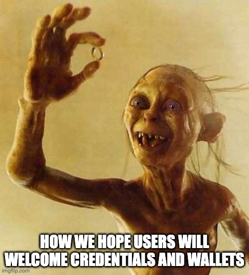
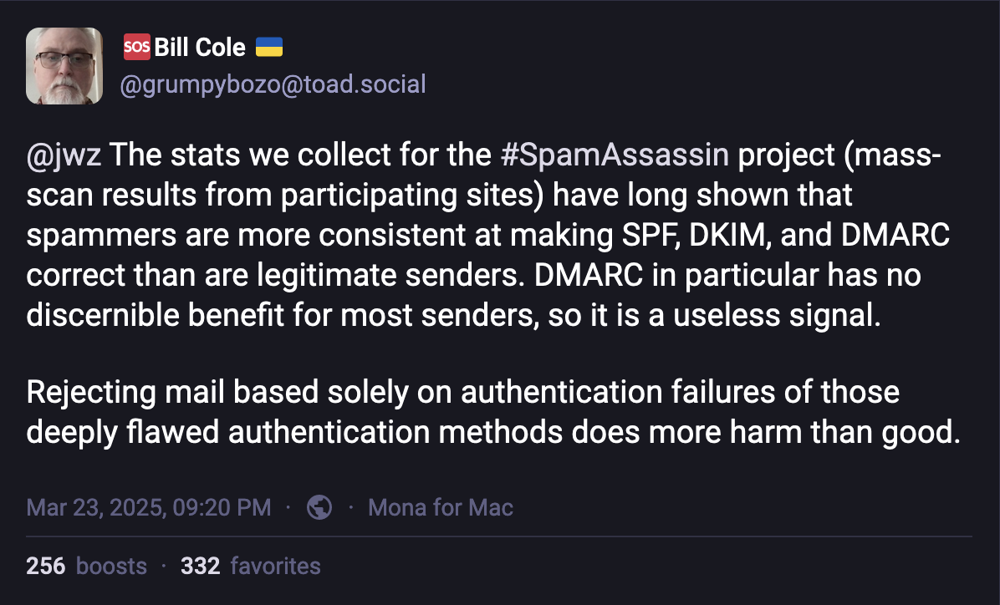
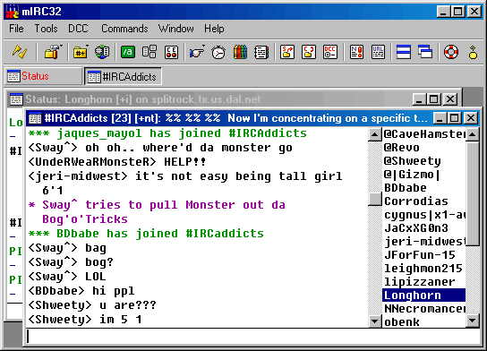

+++
date = '2025-05-29T17:00:00+01:00'
draft = false
title = 'Credentials for Thee, But Not for Me?'
+++

I'm not a regular conference attendee. I prefer to be at home with my family and my own thoughts. Conferences are a massive energy drain for me as a social introvert. I enjoy being around people, but I need sufficient me-time to ground myself. Yet, conferences are undeniably valuable. They offer a pulse into industry trends, provide inspiration, and serve as important networking events and increasingly not only with other companies but also with your own colleagues as many companies, including my own, are becoming remote-first.

Over the years, I've attended several DICE and EIC events. It has always struck me as odd that a community advocating for credentials and wallets as transformative technologies never seems to use them when the opportunity presents itself. Every year, conference attendees go through the same basic process: registering with their email, providing basic information about yourself, picking up a badge at the entrance, and using whatever siloed system the organisers have chosen this time around. For example, DICE uses [luma](https://lu.ma/) to register for the event and [Qiqo](https://qiqochat.com/) during the event, and KuppingerCole uses an IAM solution for the member area on their website and has a separate event application that you have to download and use during the event. Across other identity-related events – IIW, Identiverse, Identity Week Europe to name a few – the situation isn't much different.

Sure, one might argue that events don't require high-assurance identity credentials, but exactly because of that, they would serve as the perfect playground. The stakes are low, the environment friendly, and the attendees, at least in theory, should be eager to experiment and provide feedback. Event organisers could simplify their own solutions, using credentials for registering, access to the venue, backstage areas and so on.

What's holding back adoption in a community seemingly best placed to demonstrate the value of digital credentials? Is the technology not ready? Are there certain barriers that complicate deployments? Is it commercially unfeasible? Or do conference organisers simply not talk to each other?

My mind naturally drifts towards solutions as it feels so obvious. But if "standards-first" development truly is the way forward, why aren't we doing exactly that in our own backyard?

## What's Holding Us Back?

Several reasons might explain why digital credentials haven't found widespread adoption within the identity community's own events. Let's examine some potential barriers.

**Premature Perfection**

Perhaps we are trying to skip necessary steps, overly confident in our ability to envision a perfect solution, yet underestimating the complexities and practical hurdles. We might be focusing on the end state without fully understanding the incremental problems along the way.

It brings to mind Donald Knuth's famous warning[^knuth]:

> "Premature optimization is the root of all evil."

In our case, it's not performance we're prematurely optimising, but architecture and standardisation. We're designing for every possible edge case before there's proven demand. Instead of prioritising simplicity and evolving through usage, we're solving problems that might never materialise or only for a small group of credentials. In doing so, we risk losing sight of what what users need and where we need to lower the barrier of entry.

**Chicken and Egg Problem**

Without users, there's no incentive for verifiers; without services, users see no reason to adopt. Adoption can't simply be mandated, it emerges organically and often unplanned. 

Consider Belgium's experience with *[Itsme](https://www.itsme-id.com/en-BE)* as an example. When the COVID-19 pandemic hit, the government needed a way to quickly authenticate citizens in a new mobile app for accessing vaccination records. Itsme, already in the market and built on OpenID Connect, offered a robust and mobile-ready architecture that made integration easy. But it wasn't the standard or technical design that triggered adoption,it was the urgent user need.

The OpenID Connect protocol was never specifically designed for this public health use case, yet it proved adaptable enough to meet the moment. This was the event that tipped the scales in what is now seen as a success story.

**Competition**

Not every market is actively seeking new identity solutions. The principle of "10x improvement" applies here: people rarely switch from familiar, reliable tools unless there's an overwhelmingly better alternative. If the EU Digital Identity (EUDI) Wallet is fully operational by 2026, why would a user from Sweden abandon the ubiquitous, trusted BankID?

My view is that mDL can be successful in markets, such as the US and Australia, exactly because those are missing reliable ways for proving your identity. There are many countries where this is not the case and it is considered a solved issue.

**Product thinking**

In the quintessential product management book, *"Jobs to be Done,"* Jim Kalbach explains that the main competitor to QuickBooks wasn't other accounting software, it was pencil and paper. Similarly, are we sure digital credentials significantly improve existing processes? Reading about PID verification or mDL security often leaves me sceptical. Will people genuinely feel it's easier or more empowering than just using their physical identity card? Users might prefer simplicity, autonomy, and familiarity over perceived technological advances touted by people with a vested interest.

## Lessons from Email and Messaging Protocols

To understand the challenges digital credentials face today, we can look at how a couple successful technologies historically found their footing.

### Email's Journey: From Early Utility to Evolving Standard[^smtphistory]

Email is a prime example of a technology that thrived because it addressed real user needs before formal standards emerged. In the 1960s and 1970s, simple message-passing systems existed within mainframes and on ARPANET. In 1971, Ray Tomlinson sent the first networked email, famously introducing the "@" symbol to separate user and host[^atsymbol].

Early email protocols like FTP Mail ([RFC 733](https://datatracker.ietf.org/doc/html/rfc733)) and MAIL were limited in scalability and usability. Only in 1982 did Jon Postel publish [RFC 821](https://datatracker.ietf.org/doc/html/rfc821), formally defining the Simple Mail Transfer Protocol (SMTP). By then, email had already become widely adopted in academic and research communities. 

SMTP succeeded because it was flexible and addressed proven needs. Later enhancements such as ESMTP (1995), TLS encryption, and authentication protocols like SPF ([RFC 4408](https://datatracker.ietf.org/doc/html/rfc4408)), DKIM ([RFC 4871](https://datatracker.ietf.org/doc/html/rfc4871), and DMARC ([RFC7489](https://datatracker.ietf.org/doc/html/rfc7489)) built incrementally upon its foundation, solving needs that emerged from its massive user base.

*As a funny side note. Do you know who is really good at implementing these protocols that are there to keep bad actors out? That's right, spammers.* [^spam]

### Messaging Protocols: From IRC to Signal

My first encounter with instant messaging was IRC. In the late 1990s and early 2000s, as a young adult into online gaming (Counterstrike), IRC was how my friends and I communicated. The prevailing client at the time was [mIRC](https://www.mirc.com/), which is, to my surprise, still maintained to this day.

IRC, launched in 1988, quickly became popular due to its openness, decentralisation, and adaptability. It introduced features we now take for granted: public channels, private messaging, bots, and moderation commands. IRC became the communication backbone for many open-source communities and tech circles.

Its protocol is described in [RFC 1459](https://datatracker.ietf.org/doc/html/rfc1459), released in 1993. Inching up to its 50th birthday, it appears to be still under development, mostly centered around [Libera Chat](https://libera.chat/). The "Modern IRC" specifications are maintained by an informal working group and can be found at [IRCv3](https://ircv3.net/irc/).

IRC had significant limitations. For instance, it lacked offline message delivery, encryption, and strong user authentication. Newer platforms like ICQ and MSN Messenger filled these gaps, offering more user-friendly, secure alternatives. It might sound strange, but it was kind of magical to have the possibility to send offline messages. IRC's limited evolution eventually led to its decline.

In response, new protocols like XMPP (Jabber) emerged, offering interoperability between servers. It was first standardised in [RFC 3920](https://datatracker.ietf.org/doc/html/rfc3920) in 2004. Yet, XMPP failed to achieve broad consumer adoption due to complexity and limited usability compared to simpler proprietary solutions. Don't get me wrong, it is still used by the likes of WhatsApp and Zoom[^xmpptoday], but they've added their own proprietary extensions[^whatsappdev], creating silos rather than enabling federation.

Then you had Signal. Unlike IRC or XMPP, Signal was designed from the outset for security, privacy, usability, and end-to-end encryption. The [Signal Protocol](https://signal.org/docs/), developed by Open Whisper Systems, became a de facto standard, adopted by platforms such as WhatsApp, Facebook Messenger, and Google Messages. Not because of formal ratification as it is not standardised through a formal SDO such as IETF, but because it effectively addressed urgent user needs at scale.

More recently, the [Matrix protocol](https://matrix.org) has tried to rekindle the ideal of open, federated messaging. This time with modern requirements like encryption and rich media support built in. Entirely open source, Matrix offers bridges to older systems like IRC and newer ones like Slack. Despite this promise, Matrix has yet to reach mainstream adoption. The dominance of corporate platforms like Microsoft Teams and Slack, each with their own proprietary protocols, suggests that openness alone may no longer be enough. Usability, integrations, and ecosystem control appear to matter more than standards-based interoperability.

### Key Lesson from Email and Messaging

The contrasting histories of email and instant messaging offer valuable insights:

**Email (SMTP)** succeeded because it provided a simple, flexible, and open standard at the right moment. SMTP became a robust backbone for a global, decentralised ecosystem of many interoperable vendors and services. Its simplicity allowed incremental improvements over time, ensuring broad adoption and long-term stability.

By contrast, **instant messaging** began similarly open (IRC, XMPP) but evolved toward more centralised, siloed solutions like WhatsApp, Slack, and Discord. The reason? User experience and security became priorities, often achieved through proprietary enhancements incompatible with open interoperability.

The critical takeaway is that openness and standardisation alone are insufficient for lasting success. While openness can drive initial adoption, sustained longevity requires addressing evolving user expectations such as usability, security, and privacy without sacrificing interoperability. Digital credentials today risk repeating the mistakes of messaging by starting from complexity rather than simplicity, and prioritising standardisation over usability.

To succeed like email, credentials must prioritise simplicity, openness, and allow for incremental evolution. We need to ensure interoperability doesn't come at the expense of user experience or practical adoption.

## Digital Credentials: Solving Problems Before They Exist?

Digital credentials seem to be following an inverted path compared to successful technologies like email and early messaging protocols. Instead of solving immediate practical needs first and evolving standards incrementally, the identity community has taken a standards-first approach. We've been designing these standards for over a decade, yet widespread adoption always seems to be a case of "next year syndrome." This raises an essential question: could standardisation itself be hindering adoption?

We risk solving imaginary or edge-case problems rather than focusing on proven, practical user needs. Engineers often fall prey to over-engineering, reflecting something akin to Parkinson's Law, which states:

> Work expands to fill the time available for its completion.

Adapted for standards committees, one might say:

> The complexity of a standard expands to fill the time available for its completion.

As an implementer, I experience firsthand the challenges of keeping up with the continuous changes and growing complexity across multiple standards. These standards are not inherently bad, but practically, this complexity is slowing down adoption. Significant resources are consumed simply keeping pace rather than delivering practical outcomes for users.

In essence, we have prioritised upfront complexity over ease of adoption and incremental improvement. From a national ID system perspective, long-term planning is understandable. However, this extensive upfront complexity is blocking rapid, incremental adoption in other contexts.

Moreover, users and implementers are caught in a standoff: users await maturity and ease-of-use, while implementers wait for demonstrated user demand. Right now, we're placing most of our bets on large-scale, government-driven digital ID solutions. But what if these solutions prove overly complicated or cumbersome for everyday use? Increasingly stringent measures to protect users could inadvertently make digital credentials less convenient and appealing than traditional methods. If the friction becomes too high, users may simply stick to familiar, low-tech alternatives. After all, we always have to keep in mind that not a single user is waiting for digital credentials per se, they're waiting for solutions that make their lives easier.

## Conclusion

At some point, we'll have to put a stake in the ground. Once that happens, we'll quickly uncover what's missing, what's wrong, and what needs improvement. We'll simply have to accept those limitations. We've spent enough time in theory and standardisation. Now is the time to face reality by actively searching for practical, real-world use cases that will help digital credentials gain traction.

We must allow genuine user needs to guide us, rather than letting technological debates dominate the conversation. Let's remain open to the idea that government-issued IDs may not be the one credential to rule them all. Instead, our immediate focus should be simplicity, ease-of-use, and rapid practical deployment.

And finally, let's lead by example. Let's start using these solutions ourselves. Event organisers, identity professionals: if you're reading this, let's connect and explore real opportunities to put digital credentials to use at your next event. It's time we ate our own dog food.

## References

[^smtphistory]: Rikke. “The History of the SMTP Protocol.” mySMTP BLOG (blog), September 9, 2024. https://mysmtp.com/blog/2024/09/09/the-history-of-the-smtp-protocol/.

[^atsymbol]: "Email Inventor Ray Tomlinson Dies at 74," BBC News, March 6, 2016, https://www.bbc.com/news/business-35741116.

[^spam]: toad.social. "Bill Cole (@grumpybozo@toad.Social),"March 23, 2025. https://toad.social/@grumpybozo/114213600922816869.

[^xmpptoday]: “Projects using XMPP-based Instant Messaging” Accessed May 29, 2025. https://xmpp.org/.

[^whatsappdev]: Meta. “DMA Interoperability Developer Documentation: Overview of the Technical Framework,” September 6, 2024. https://developers.facebook.com/m/messaging-interoperability.

[^redditmirc]: https://www.reddit.com/r/nostalgia/comments/vq68uk/mirc_the_internet_relay_chat_program_from_the_90s/

[^knuth]: Knuth, Donald E. “Computer Programming as an Art.” Commun. ACM 17, no. 12 (December 1, 1974): 667–73. https://doi.org/10.1145/361604.361612.
