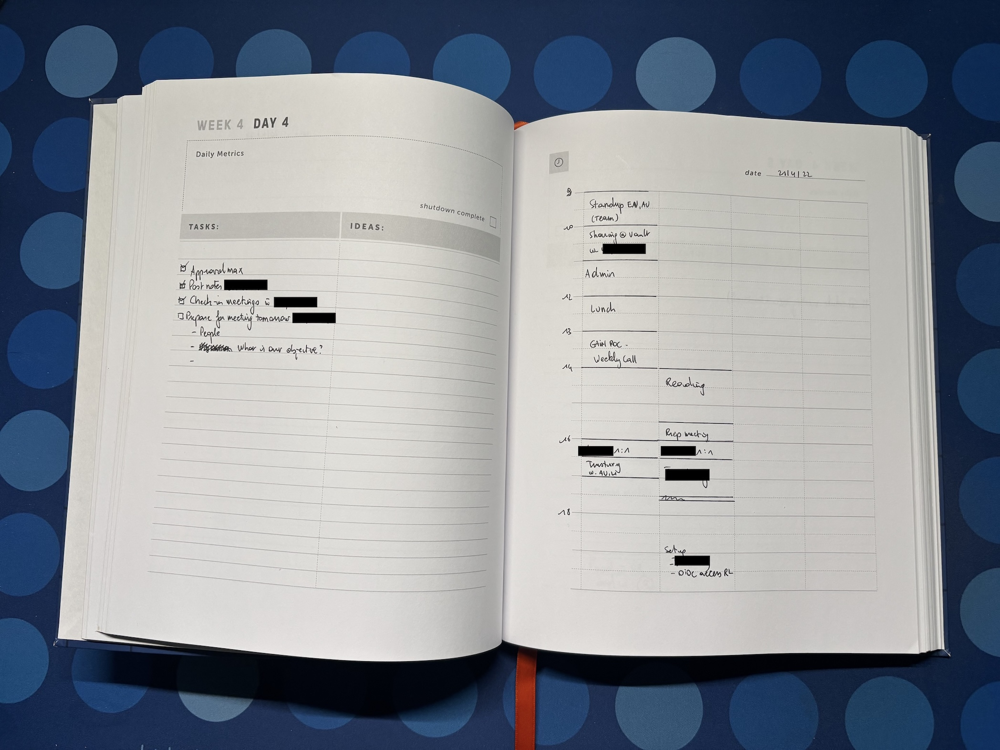
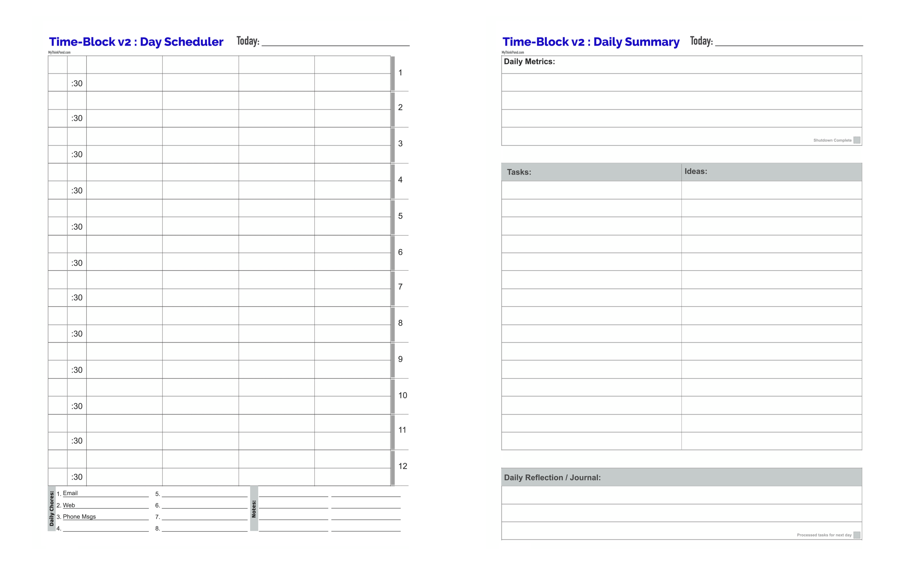
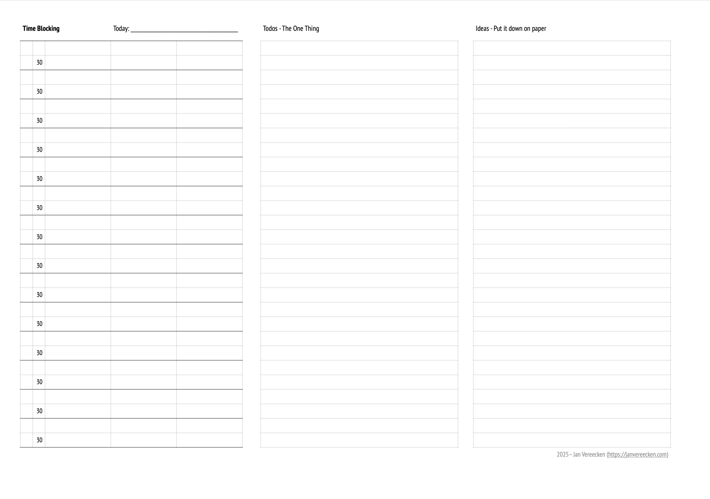
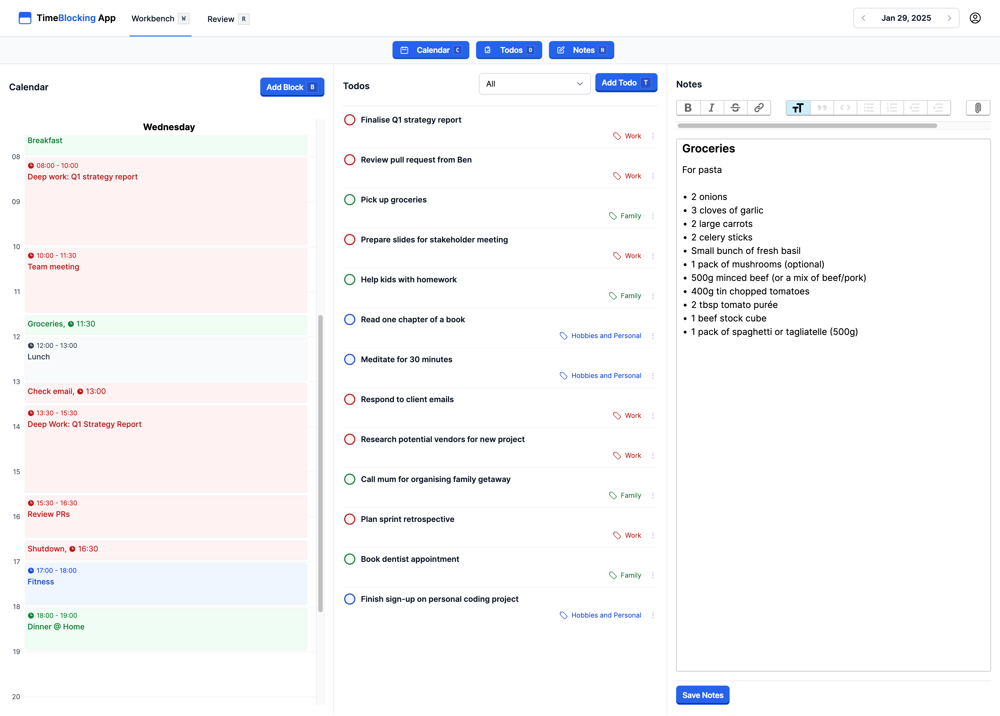

+++
date = '2025-10-27T10:00:00+01:00'
draft = false
title = 'Personal Productivity Journey'
+++

## The Early Days

I started working in 2007 with no system to speak of. When you’re young, you rely on sheer willpower to get things done. Life was simpler. No family. No major responsibilities. You manage to keep up. But as the years pass, life and career grow more demanding. Fast forward a few years and suddenly things have changed. You have a house, a mortgage, family commitments, a business to run, and mountains of work. Priorities all competing for attention. That’s when it hit me: I needed a system.

Like most people, I began with the simplest solution: a to-do list. I’d jot down everything I needed to do, assuming that writing it down would magically make it happen. But it didn’t. The truth is, a to-do list is often just “a list of things I wish I could do.” There was no structure, no way to prioritise and ensure I could actually complete the tasks.

I worked in a scattered way. Some things got done, usually at the cost of late nights and mounting stress. But more often than not, I was consumed by daily distractions. Meetings piled up, emails poured in, and “busy” became the default state. 

## Busyness as the Norm

Everyone has probably had the following conversation a million times:

> You: How are you doing?

> Friend: I'm doing alright. It's crazy at work though. I'm super busy.

This is social signaling for: "Look at me, I'm still relevant at my job and a contributing member in my group". It's fine, this is human behavior. If you would continue your inquiry – which you should never do – you often find that "busy" means "doing lots of hours". In knowledge work, where I have been active for my whole professional life, there is no metric that correlates well with productivity. It's a blessing and a curse at the same time. The closest that we've seen to have come is to use "time spend at a desk at work". Contrast this with a painter, where you can say that on average they should be able to do X amount of square meters on a given day. None of that clarity in the knowledge economy. It is just raw hours spent on something and, surprise surprise, people get really good at spending lots of hours. A non-trivial part of those would be spend in meetings or communicating via (corporate) messaging platforms (e.g. Slack, Teams).

I don't know about you, but I can't get anything meaningful done in back-to-back meetings. I'm willing to bet most people can't. Productive meetings require preparation, clear agendas, and follow-ups when they are finished. These were things I wasn’t prioritising.

As the days blurred together, I felt unsatisfied. I was working hard, but not in a way that truly moved me closer to my goals. I needed more than just shear effort. I needed clarity.

## Searching for a System

I started exploring protocols. David Allen’s Getting Things Done (GTD), the Eisenhower Matrix from 7 Habits of Highly Effective People, and Cal Newport’s ideas on time blocking all made their way into my life. Each had valuable insights, but none of them worked for me as a complete system. They felt fragmented, useful pieces, but somehow the puzzle wasn't yet complete.

**GTD** is about getting things out of your head into a system. The entry point is an inbox and from then on you start processing it, breaking tasks up and moving it into different lists depending on what it is. I love the premise: getting it out of your head and reduce mental burden, but the system of lists is too much. You then also start to look into tools and at some point I was more thinking about where to put everything, how to move it through the system, if it is the right place. I mean, I was thinking more about the protocol, than actually executing tasks. For me, at the time, it was too complex.

The **Eisenhower Matrix** is a tool used by US former president Dwight Eisenhower that allows you to organise tasks on two main axis: urgency and importance. This creates four quadrants: do (urgent & important), schedule (not-urgent & important), delegate (urgent & not important), don't do (not urgent & not important). This is a tool that helps you frame a task, consider if it is important and/or urgent. I believe it helps avoid the recency bias. Often people are simply doing the last task they received as it is the one they perceive as important. I work in a small company, where work is plenty and people are scarce. What ended up happening was that I was working on seemingly urgent and important tasks every day, but that the big meaningful things weren't progressing or had to be scheduled after a full day of work. It was missing something.

Around that time, I was introduced to **time blocking** through the work of Cal Newport who has been [writing about this concept for a long time](https://calnewport.com/deep-habits-the-importance-of-planning-every-minute-of-your-work-day/). That idea, together with his book about [Deep Work (2016)](https://www.goodreads.com/book/show/25744928-deep-work) articulated concepts such as focus, flow and working at a pace that is most inducive to producing high-quality work. Everything in the modern working environment is against you. There is a barrage of interruptions thrown at you: messaging from colleagues who just have quick question, then there is your phone, social media, youtube and so on. Distractions are everywhere. Distractions are the enemy of quality. On the contrary, quality comes from being able to focus for extended periods of time, without any disturbance. Time blocking is a way of making sure that you block time in your calendar to create these opportunities. I went from constantly checking my mail to doing it a couple of times per day. I consciously created 2-hour (or more) blocks to work on things that I knew require focus, time, instead of focussing on the urgent (but not always important) tasks.

Fast forward to the present and I now have a stable, reliable protocol. It's a blend of tools and protocols mentioned above mixed in with practical experience that works for me. It is simple, adaptable and helps me achieve my goals.

## A System That Works (For Me)

The productivity protocol is based on three core principles:

1.	**Focus on ONE thing**: Prioritise the single most important task and give it your full attention.
2.	**Time block your day**: Make a plan for the day ahead. Dedicate specific periods to the most important tasks and protect that time from distractions.
3.	**Create space to think**: Write everything down, step back regularly to reflect, plan, and recalibrate.

Is that it? Yes, that's it. As with many things in life, the devils is in the details. From my own experience, and also from observing others, I've noticed that everyone, young to old, unexperienced to experienced fails at one or more of these. When you just start working, figuring out the most important task might be daunting. On the other hand when you have more responsabilities and lots on, prioritising inevitably means dissapointing some people. Distractions impact everyone and the question is not if you succumb, but when. Technology is not doing us any favours in this department. Writing is no longer a skill that is practised, rather we converse in short dialogue, unable to explain deep thoughts and communicate them to others. This means we have a lot of "thoughts", but when challenged, most people are unable to put them to paper and realise their "thought" is not that brilliant idea they thought they'd had.

I plan to expand on my process in a future article, but for now I think this will do.

So, this system is simple, but it’s adaptable. It doesn’t get in the way. It's super flexible on how you do it. No fancy tooling required if you don't want it. You can literally do it on the piece of paper closest to you and just go.

I've done it in beautiful books such as this Time Block Planner.

I've used a planner from a guy that seems to be on a similar journey at [Digital River](https://digitalriver.blog/post/2022-01-1/).

And, I've created my own print template

Feel free to [download](./JanVereecken_TimeBlocking_Planner.pdf) and check it out.

These all work fine and if you like, you can give them a try.

## TimeBlockingApp - My Digital Productivity Tool

During the past winter break, I started conceptualising a digital version of this tool. I brushed up on my Ruby on Rails skills and started coding. The result of this endeavour is a small web application called: 

TimeBlockingApp which you can visit at [timeblockingapp.com](https://timeblockingapp.com).

It is developed by myself and hosted in Germany. It is a simple tool that I've used daily for the last 9 months.

It is meant to support the process described above. Every day you start with a blank calendar, and if you want an empty todo list. I have implemented a "Review" functionality that allows you to review and copy the last todo list as in paper form, I often ended up copying items. You can tick off todos (that lovely feeling) and there is a place to jot down whatever thoughts you have (don't hold back).

If you're interested, than please sign-up and give it a spin. Let me know how it goes.

