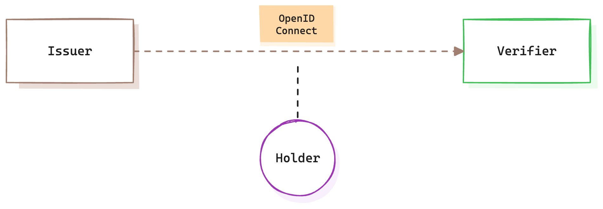
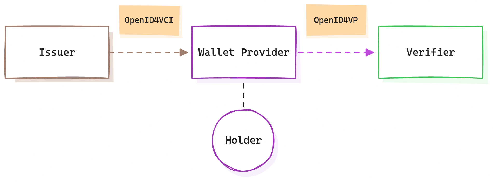
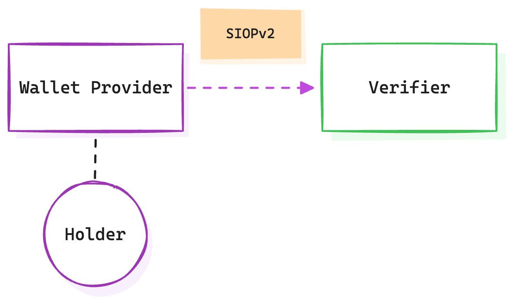
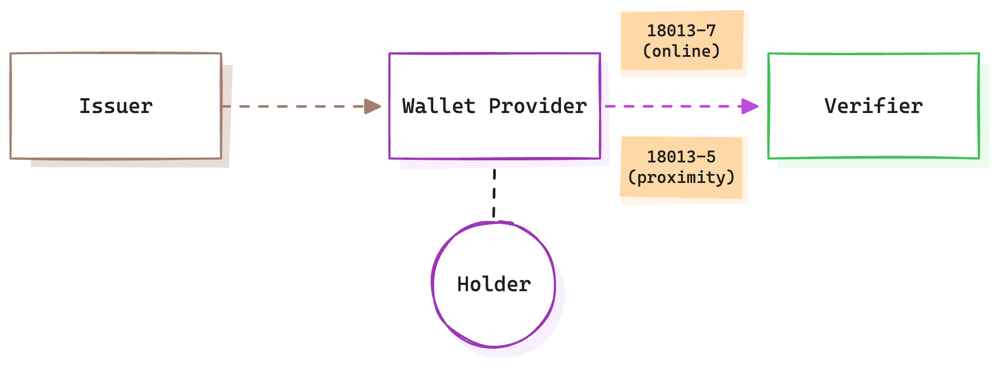
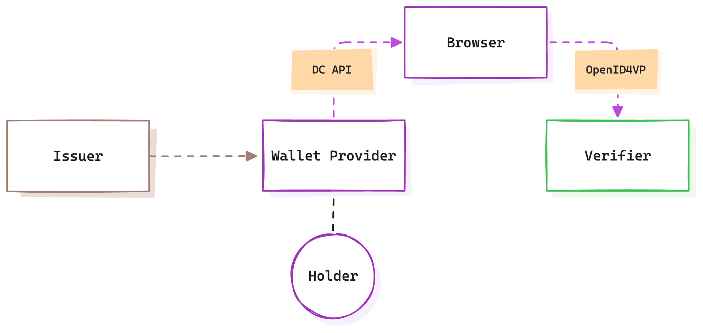

+++
date = '2025-02-27T18:00:00+01:00'
draft = false
title = 'Laying the Rails for Personal Data Exchange'
+++

In our [previous article](), we introduced a framework designed to underpin the secure and efficient exchange of personal data. At its core, this framework relies on three fundamental components: rails, credentials, and trust. These elements work together to ensure that personal data can be shared in a manner that is both secure, has a wide reach and provides opportunities for all parties involved.

In this article we take a look at the foundation of the framework, the rails.

## Rails

Developing standards-based, interoperable rails is key to enabling the adoption and participation in data networks. Rails are the protocols that describe how entities establish connections and communicate with each other.

The table below lists three contenders. 

|  | OpenID Connect | ISO/IEC mdoc | Platform Rails (Apple & Google) |
|:--|:--|:--|:--|
| Focus | Online Identity | mDL | General Purpose |
| Adoption | High | Low | Very High |
| Ecosystem | OpenID Ecosystem | Government | Apple, Google Ecosystems |
| Use Case | Online | Proximity | Proximity |
| Access | Public | Paywall | Proprietary |
| Credential Format | Multiple | mdoc | Multiple |

It is important to keep in mind that these rails don’t necessarily compete with one another. ISO/IEC, for example, references OpenID4VP in their 18013-7 standard. Both Google and Apple support mDL and are actively contributing to different specifications and standards. Google has even open-sourced an identity wallet under the OpenWallet Foundation. I do think that each of these come from different perspectives and background and their end-goal is not always the same. What is more important is that we start to define a lens through which to see these and others that emerge.

Let's explore these in a bit more detail.

### OpenID

A set of specifications and standards developed by the [OpenID Foundation](https://openid.net/) that are publicly available and that govern the issuance and presentation of credentials:

- **[OpenID Connect](https://openid.net/specs/openid-connect-core-1_0.html)**: Describes how an issuer and a verifier can exchange information about a holder

- **[OpenID 4 Verifiable Credential Issuance](https://openid.net/specs/openid-4-verifiable-credential-issuance-1_0.html):** Describes how an issuer and holder exchange credentials about the holder, using a wallet (provider)
- **[OpenID 4 Verifiable Presentation](https://openid.net/specs/openid-4-verifiable-presentations-1_0.html):** Describes how a holder and verifier exchange credentials

- **[Self-Issued OpenID Provider](https://openid.net/specs/openid-connect-self-issued-v2-1_0.html):** Describes how a holder can exchange self-issued credentials with a verifier

These specifications define APIs that all involved parties (Issuer, Holder, and Verifier) must implement to facilitate credential issuance, reception, requests, and presentation. OpenID-based specifications primarily focus on online use cases.

This set of standards and specifications stands out due to several key factors. Firstly, it has been under development for many years (OpenID Connect 1.0 was released in 2014), and where possible they build upon each oter. Secondly, it has seen significant adoption, particularly OpenID Connect, which is now widely used in production environments around the world, specifically for identity related information. Finally, these standards provide the rails that allow the three models of exchange (issuer-verifier, issuer-holder-verifier and holder-verifier) to take place, ensuring broad applicability across different use cases.

### ISO & IEC mdoc

[ISO](https://iso.org) and [IEC](https://iec.ch) are international standards bodies that have been around since 1947 and 1906 respectively. ISO/IEC define globally recognised standards, making them easier to adopt and integrate into governmental and organisational frameworks. Not all standards organisations are created equally and it's fair to say that these two are the gold standard so to speak. 

They publish a wide variety of standards, most of them are not publicly accessible and require you to purchasethem. Not everyone can freely contribute and usually some costs are involved in doing that.

Relevant to us are the following standards:

- **[ISO/IEC 18013-5](https://www.iso.org/standard/69084.html)**: Defines the Mobile Driving Licence (mDL) application.
- **[ISO/IEC 18013-7](https://www.iso.org/standard/82772.html)**: Adds functions to mDL, including reference to OpenID4VP as a presentation method.
- **[ISO/IEC 23220-3](https://www.iso.org/standard/86783.html) and [23220-4](https://www.iso.org/standard/86785.html)**: Describe a more generic approach to personal identification using Mobile Documents (mdoc).

These standards define end-to-end processes for both proximity-based and online flows. Notably, ISO 18013-7 references OpenID4VP as a method for presenting mDLs, showing increasing interoperability between ISO standards and OpenID.

Another interesting fact is that where OpenID4VCI and VP are credential format agnostic, these rails require the use of the mdoc credential format.

In the diagram below we see where ISO/IEC 18013-5 and -7 are positioned. As you can see, they specifically focus on presentation. The rails to issue a credential from the issuer to the holder is not specifically defined.

Note: ISO 18013-5 also describes how mDL can be presented from the issuer to the verifier (via OpenID Connect for that matter), but typically when you now hear someone mention mDL, they mean the issuer-holder-verifier model, where the holder presents the mDL from a wallet.

### Platform Rails (Apple & Google)

Apple and Google hold dominant positions in the mobile and browser markets, providing critical infrastructure for identity solutions. Their platforms serve as the de facto identity/data rails:

- **Mobile Wallets**: Installed by default on every mobile device, removing an important onboarding obstacle. These platform wallets have priviledged access to Secure Elements of the device, something other applications don't have.
- **Digital Credentials API**: Enables standardised credential requests and presentation, enabled by integration between browser and operating system.
- **Ecosystem Control**: They use both open standards and proprietary solutions.

These platforms already support various credential types and rails, from loyalty cards and event tickets to digital IDs and payment cards. More advanced use cases require agreements with the platform providers, often involving access to Secure Elements and associated fees.

Below is a diagram that explains the [Digital Credentials API](https://wicg.github.io/digital-credentials/), a relatively new piece of the puzzle that is taking the standards world by storm. What makes this stand out is that it's an API built into platform browsers that is able to mediate presentation of credentials from a wallet. One of the main drivers for this is security, which is often an issue with other presentation options described in OpenID4VP.

While this approach is promising, it is important to also point out that this is building another dependency on the platform browsers and having them in between every conversation does at least warrant careful consideration.

Both companies actively participate in standards development (as shown above), ensuring that their ecosystems remain compatible with broader industry efforts. At the same time, they also integrate with proprietary rails when the use case demands it, meaning that they are not necessarily committed to only use standardised rails. In the end these are privately held companies that will do what is best for them and their shareholders.

