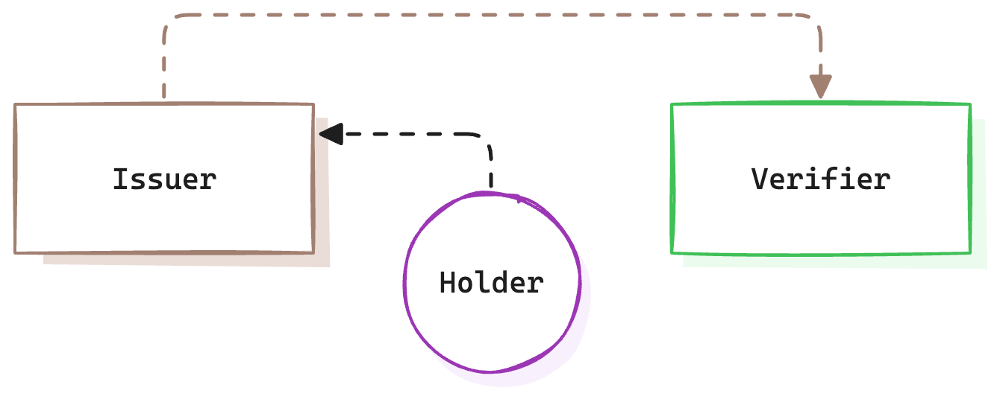
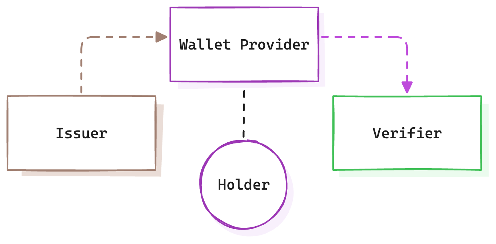
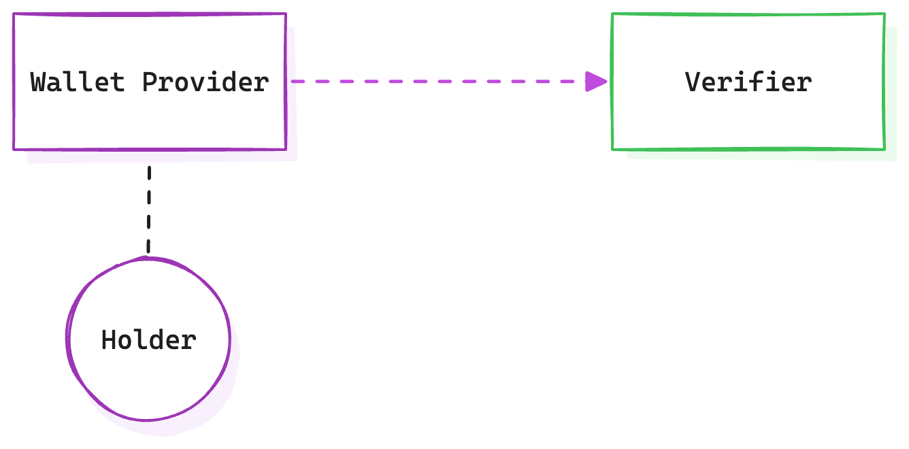

+++
date = '2025-01-28T14:34:54+01:00'
draft = false
title = 'Towards a Universal Model for Personal Data Exchange'
+++

Digital services thrive on personal data. They need it to function. In some cases, they are even required to verify it, usually for compliance or risk management. However, beyond necessity, certain companies have built their business models around collecting, hoarding and monetising personal data, often without users fully understanding the trade-offs. The core issue is that we lack a robust framework for managing and exchanging personal data. Existing methods come with limitations, and while improvements are possible, we must prioritise good user experience (UX) to ensure widespread adoption.

To address this, we can conceptualise three distinct models of personal data exchange. These models operate across three essential components, and by establishing the right infrastructure, we can enable personal data to flow more freely, transparently, and securely.

## The Reality of Personal Data Exchange

Whenever we use a digital service, we participate in a value exchange. This might be explicit —paying money for a subscription— or implicit —providing data in exchange for “free” services. Personal data, especially when aggregated, has become one of the most valuable commodities in this ecosystem.

Take services like Google Search, Instagram, or Twitter. At first glance, the exchange isn’t obvious. Users get free access to these platforms, but what funds their operations? Often, it’s advertisers, whose primary demand is targeted reach. Platforms meet this demand by profiling users, which requires gathering and processing personal data. This incentive structure drives many companies to collect as much data as possible, turning personal information into a core asset.

Breaking this cycle requires conscious effort. For instance, supporting services with strong data privacy policies often means paying for features that are otherwise free. However, even as users become more privacy-conscious, the challenge of data exchange persists: how can we manage personal data in a way that benefits both users and service providers?

## What’s the Problem?

The fundamental issue is that personal data exchange is necessary but flawed. Today, most exchanges rely on self-asserted data or cumbersome verification processes.

**Examples of self-asserted data include:**

- Checking a box to confirm you’re over 18 for age verification.
- Filling out a contact information and a shipping address on an e-commerce site.

**Examples of verified data include:**

- Providing a government ID for identity verification when opening a bank account.
- Submitting proof of academic qualifications, such as a (digital) diploma or transcript, when applying for a job

Businesses often require this information for regulatory compliance or risk management. However, these requirements introduce friction, which users tend to avoid. Consider the utter failure of cookie banners. Most users, even those who are aware of the dangers, dismiss them without meaningful interaction (although the dark patterns used have something to do with it as well). It’s a case where poorly designed processes only frustrate users, creating barriers rather than seamless experiences.

**Who holds personal data?**

1. Trusted third parties: Governments, banks, universities and utility providers maintain verified records for their services.
2. Individuals: Users hold unique personal data that cannot be verified externally, such as preferences, allergies. We can categorise these as self-attested claims.

The challenge lies in enabling the secure, efficient, and user-friendly sharing of this data while preserving user autonomy and trust between all parties and the data that is shared.

## Three Models for Personal Data Exchange

To better understand how personal data flows, we can explore three conceptual models:

1. Issuer-Verifier Model
2. Issuer-Holder-Verifier Model
3. Holder-Verifier Model

### 1. Issuer-Verifier Model

In this model a 3rd party, called the Issuer, can attest to claims about the user. The receiver of this data, Verifier, can verify this information is authentic and untampered. The user is involved in so far that she consents to information being shared.

When you log in to a website using “social login” (e.g., Google, GitHub), the Issuer (e.g., Google) directly sends your data (e.g. name, email) to the Verifier (the service you’re accessing). 

While widespread and convenient, this model raises serious privacy concerns, as Issuers track your activity to monetise the insights. This transactional nature is why these services are often free — they profit from knowing which services you use and how often.

### 2. Issuer-Holder-Verifier Model

This model introduces the Holder (the user) as an intermediary between the Issuer and Verifier of the previous model. The Issuer provides data to the user, Holder, who decides when and how to share it with Verifiers. 

This approach gives users more control and autonomy and reduces direct data sharing between Issuers and Verifiers, enhancing privacy. It does however introduce usability- and lots of technical challenges.

This is a model that is under active development and we’re seeing large scale production use cases go live in the US and elsewhere, mainly with mDL (Mobile Driver License). The EU promises that by end of 2026, all of its 450 million citizens, will have access to digital credentials (digital id being the first).

### 3. Holder-Verifier Model

In this model users share their data directly with Verifiers, often through web forms. Despite its simplicity, this approach has seen little innovation since the advent of the internet. Autofill tools for addresses and payments have improved convenience somewhat, but there’s no standardised, user-friendly way to exchange self-asserted, personal data.

## The Framework: Three Essential Components

To enable seamless and secure personal data exchange, we need three critical components:

1. **Rails**: These are the standards and mechanisms that enable secure, interoperable data exchange. Examples include protocols like OpenID (for Verifiable Credentials) or ISO standards for digital credentials (e.g. ISO 18013-5 mDL).
2. **Data**: The structure and format of the data being exchanged. This includes verifiable credentials (e.g., JWTs, mobile documents) that ensure consistency and compatibility.
3. **Trust**: The systems that verify the authenticity and reliability of the data. Mechanisms like digital signatures, X.509 certificates, or OpenID Federation ensure that all parties can trust the data and parties involved.

## Building the Infrastructure for the Future

By combining these models and components, we can create a universal framework for personal data exchange. This framework would make data flows more efficient, transparent, and user-centric, striking a balance between privacy, security and user experience. With the right infrastructure in place, we can unlock the true potential of personal data while preserving individual privacy and autonomy.

Now that we have set the context, we can dive deeper into each model and get practical on how to achieve a good outcome.
