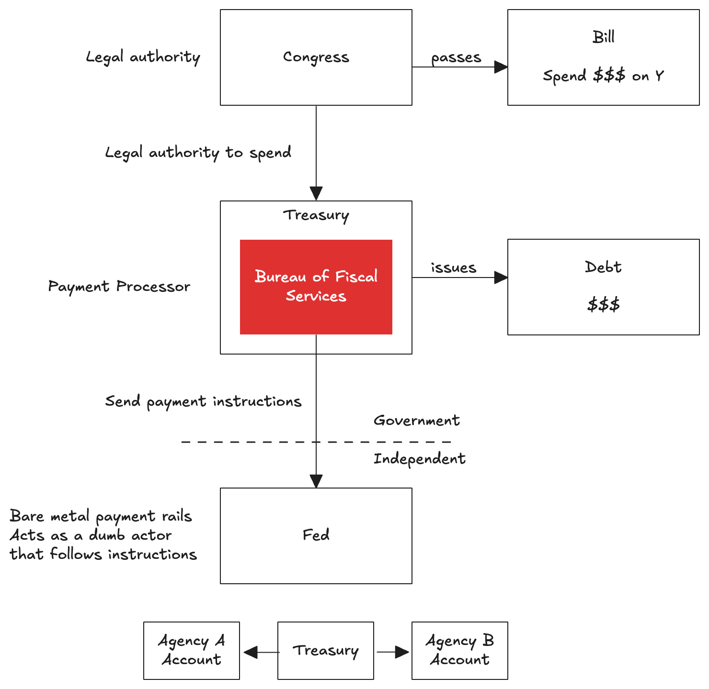
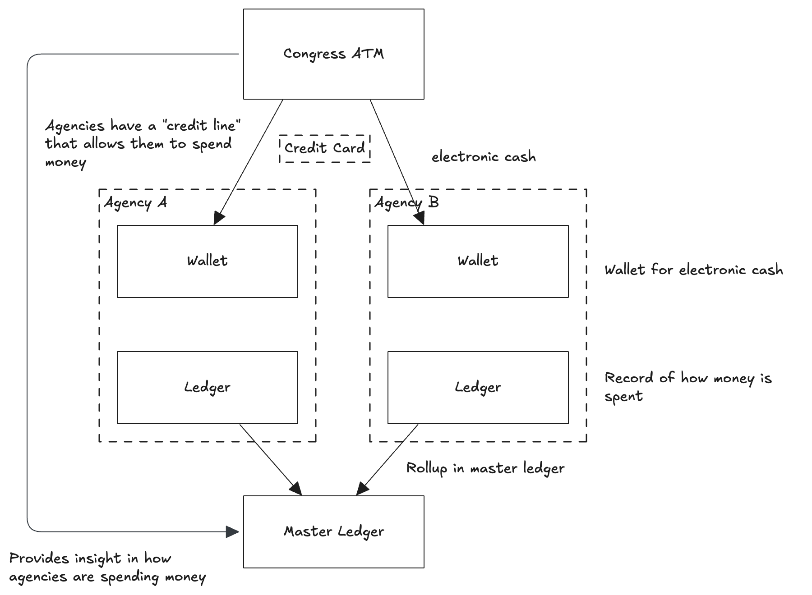

+++
date = '2026-03-30T10:00:00+01:00'
draft = false
title = "DOGE Found a Single Point of Failure. Are We Building the Same Into Digital Identity?"
+++

A year ago I listened to an episode of the Crypto Critics' Corner in which law professor Rohan Grey explained how DOGE was able to choke off 88% of US federal payments by controlling and exploiting a single, obscure office inside the Treasury. I filed it away, but it keeps coming back to me, because the architectural flaw that Grey identified is not unique to fiscal systems. It is the same flaw that can be exploited in centralised digital identity infrastructure, and it isn't one that we can ignore.

## DOGE: Finding The Weakness

I was first introduced to this topic by an episode of Crypto Critics' Corner) featuring [Rohan Grey](https://my.willamette.edu/people/rgrey), hosted by Bennet Tomlin and Cas Piancey. Rohan is an associate professor at Law at Willamette University in the USA and one of his specialisations has to do with Digital Fiat Currencies. In the episode titled ["Take Away Trump's Control over Money"](https://cryptocriticscorner.com/2025/04/29/episode-170-put-congress-on-the-blockchain-feat-rohan-grey/), Rohan describes how DOGE was able to target a single, central point in the government system, block the flow of money and take control. This central point was the Bureau of Fiscal Services (BFS). That likely doesn't ring a bell, and it shouldn't. To borrow Rohan's colourful language: "These are the most boring, beige bureaucrats". But what if I told you the BFS processes roughly 88% of the money US government agencies spend, according to Grey's account in the episode.

The way this works is that the US Congress controls appropriation (you may spend X amount on Y), but the BFS controls execution (the act of spending). The image depicted below contains my understanding of the situation:

By controlling the BFS, Trump was able to deny certain government services money. Money they were entitled to when congress passed a bill authorising spending, didn't end up their accounts because the BFS never sent the instructions. A correctly functioning BFS might be efficient, it also makes the system fragile.

## The New Digital Fiscal Regime 

A possible solution, according to Grey, is what he calls ["The New Digital Fiscal Regime (NDFR)"](https://rohangrey.net/files/Grey-DigitalFisc-Draft-Mar11.pdf). In this system congress operates a so-called ATM and each agency operates its own wallet and internal ledger. Agencies receive credit cards that allow them to withdraw electronic cash, up to the amount Congress authorised, directly into their own wallets. Each agency also maintains an accounting ledger to record how much was spent. These agency ledgers roll up into a master ledger, supporting reporting and budget preparation at the congressional level.

The core of this idea is rather elegant: rather than rely on the Treasury and the BFS to execute all payments, agencies can *directly* access the money they are entitled to, while congress maintains control over what and how much gets spent via the credit cards mechanism and master ledger.

The main architectural lesson here is clear. Systems should have as few choke points as possible, and concentration of execution power in a single, central office is a liability, not an efficiency gain.

That said, Grey's proposal is not without its own complexity. Distributing payment execution to agency-level wallets introduces coordination overheads, requires each agency to maintain its own secure infrastructure, and shifts the attack surface from one central target to many distributed ones. Whether the trade-offs are worthwhile, depends heavily on the technical implementation and governance that is required. The NDFR centralises decision making authority in Congress while decentralising the execution, which I think is the right instinct, but it is worth considering that this doesn't eliminate the risk, but instead it distributes it.

## How This Applies to Digital Identity

The three-party model at the heart of verifiable digital credentials, comprising issuers, holder (using wallets) and verifiers is not just there for technical convenience. It is a deliberate architectural choice which I think has the same systemic implications as the one Grey describes.

Consider the eIDAS 2.0 framework in the EU. At its core, it enabled citizens to hold a Personal Identification Document (PID), the highest-assurance identity credential, in a digital wallet and present it to verifiers without the issuer being involved in every transaction (as is the case with issuer-verifier systems used under eIDAS 1.0). The thing to watch out for here is that if in practice only one government body issues PIDs, only one wallet implementation exists, and trust lists are published centrally,  the system quietly collapses back into something resembling the BFS problem. The issuer and verifier could, in that scenario, communicate more efficiently using direct integration and bypass the holder (or at least revert them to a bystander). The wallet is precisely what returns control to the holder and introduces that redundancy that makes the system less fragile.

There's a direct parallel to the NDFR. Grey argues for centralising decision-making authority in Congress while decentralising execution across agencies. The verifiable digital credentials model does the same: governance and trust framework policy can remain centralised, but credential issuance, wallet provisioning, verification and trust lists should be distributed across many certified parties. Multiple trusted issuers (yes, also for the PID), multiple certified wallets, and a federated trust framework tying them together is not over-engineering. It is putting in place an architecture that prevents a single point of failure from being a single point of control.

I believe eIDAS 2.0 already allows for this. The legal and technical foundations are there. The risk is not in the specification; it is more in how quickly member states can evolve to a truly pluralistic implementation, or whether convenience, cost and time pressures lead them to stand up just one issuer and one wallet and call it a day. I understand that this is where we need to start, but as a community we need to hold each other accountable that that is not where it stops.

## Conclusion

The DOGE episode will be remembered as a spectacular failure and a political scandal. I think it should also be remembered as a systems architecture case study. Grey's analysis of the BFS is a demonstration of what happens when efficiency is optimised at the expense of resilience: you get a system that works beautifully right up to the moment someone decides to use it against you and you realise just how powerless you are. The verifiable digital credential ecosystem is at an early enough stage that we can still make deliberate choices about how centralised or distributed it becomes in practice. The technological primitives are available and give us enough options for a truly federated system. Whether we build one depends on the community, implementers, governments, standards people, and users deciding that federation is a hard requirement, rather than a nice to have. We should remember that the BFS was always meant to be neutral infrastructure. We should be careful not to build its equivalent into our own digital identity infrastructure and assume good faith will be enough to keep it safe. Often redundancy is seen as inefficient, as an unnecessary cost to be optimised away, but sometimes it keeps the whole system safe.
